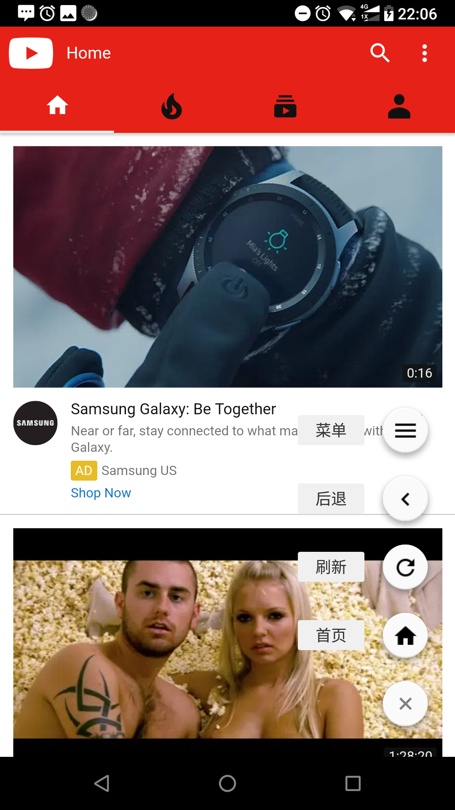

# Browser

A browser that blocks YouTube channels which you dont want watch.

一個可以屏蔽YouTube頻道的瀏覽器

## 使用方法

复制想要屏蔽的YouTube频道，单击·屏蔽·按钮，输入分隔号`|`,粘贴频道名称，确定即可屏蔽频道。

此项目开源，程序编译后小于100KB，无广告，有兴趣的朋友可自行编译。

### 默認屏蔽

```
54新觀點
ADVChina
China Uncensored
laowhy86
serpentza
SETN三立新聞網
從台灣看見世界的故事
風傳媒 The Storm Media
福氣旺旺來
郭寶勝政論
寰宇新聞 頻道
健康 好 生活
历史新知
洛杉矶华人资讯网How视频
美国之音中文网
夢想街之全能事務所
民視新聞
民視綜合頻道
明鏡火拍
腦洞大開
年代向錢看
三立iNEWS
三立LIVE新聞
台視新聞 TTV NEWS
台灣蘋果日報
头条軍事【军事头条 軍情諜報 軍事解密 每日更新】歡迎訂閱
头条历史【史料未及 野史下酒 每日更新 欢迎订阅】
伟大复兴
香港全城討論區
新闻今日
新聞面對面
新聞追追追
中華電視公司
諸葛亮歷史觀
心靈客棧
```

## 下载

[YouTube浏览器](https://github.com/grandiloquent/Kotlin-YouTube-Browser/raw/master/release/youtube_browser.apk)


## 截图
<div style="display:inline">


</div>

